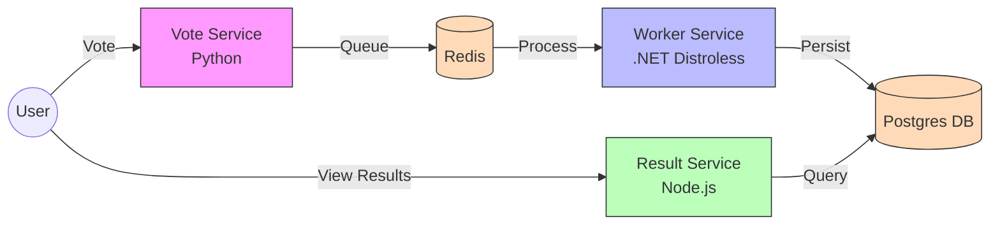

# Cloud Native Voting App (DevSecOps Capstone)


## 🚀 Introduction

This is not just another voting app. This repository represents a comprehensive **End-to-End DevSecOps Pipeline modernization** of the classic Docker example, engineered for a University Capstone Project.

We have refactored a multi-language microservices architecture into a production-grade Cloud Native system. By integrating **Infrastructure as Code**, **GitOps principles**, and **Security Shift-Left**, this project demonstrates how to deliver software reliably, securely, and automatically from commit to cluster.

## 🏗 Architecture

The system mimics a real-world distributed application with event-driven components and persistent storage.



## ✨ Key Features

- **🛡️ Security Shift-Left**: Integrated **Trivy** for container vulnerability scanning and **SonarQube** for static code analysis directly in the Jenkins pipeline.
- **☁️ Zero-Touch Infrastructure**: Entire Kubernetes cluster provisioned locally via **Terraform** and **Kind**, eliminating manual configuration drift.
- **🔒 Hardened Containers**: 
    - **Worker**: Runs on **.NET 7 Distroless** (no shell, minimal attack surface).
    - **Vote/Result**: Optimized multi-stage builds running as non-root users.
- **🤖 Monorepo CI/CD**: Intelligent **Jenkins** pipeline that detects changes (`git diff`) and only rebuilds/tests the specific microservices modified.
- **🕸️ Unified Orchestration**: Single **Helm Chart** (`voting-app-chart`) manages all deployments, leveraging Liveness/Readiness probes for **Self-Healing**.
- **📊 K8s-Native Monitoring**: Full observability stack with **Prometheus** & **Grafana** via Helm.

## 📂 Project Structure

```text
├── charts/                 # Helm Charts
│   └── voting-app-chart/   # Unified chart for all services & infra
├── terraform/              # Infrastructure as Code
│   ├── main.tf             # Kind Provider config
│   └── kind_cluster.tf     # Cluster resource definition
├── monitoring/             # Observability Stack
│   └── install.sh          # One-click Prometheus/Grafana setup
├── vote/                   # Python Flask App (Source)
├── result/                 # Node.js App (Source)
├── worker/                 # .NET Worker Service (Source)
├── Jenkinsfile             # Declarative CI/CD Pipeline
└── README.md               # Project Documentation
```

## ⚡ Quick Start

### Option 1: The "One-Shot" Command (Recommended)
You can use **Make** to run the entire pipeline in one go.
```bash
make up
```
*To destroy everything later:* `make down`

### Option 2: Manual Steps

### 1. Provision Infrastructure
Create the local Kubernetes cluster.
```bash
cd terraform
terraform init
terraform apply -auto-approve
```

### 2. Deploy Application
Install the microservices using Helm.
```bash
cd ..
helm upgrade --install voting-app ./charts/voting-app-chart
```

### 3. Enable Monitoring
Spin up the observability stack.
```bash
chmod +x monitoring/install.sh
./monitoring/install.sh
```
*Access Grafana at `http://localhost:3000` (User: `admin`, Pass: `admin`)*
 
--- 
**Capstone Team**: [Duc Tai Phan]
